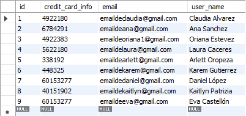

# Making the Final IronHack Project
This project is a back-end API (application programming interface) following the best practices of a REST API, it was made with Java  and SpringBoot Framework  This is an API where an Admin can add, update, delete, and get information
from users inscribed and interested to receive aerial classes to workout and have some fun for a while. For the moment, the Admin is the only user who has access and have permissions to
update all the info presented in the Academy.

## 📝 Instructions
It is necessary to have installed the following softwares:
- IntelliJ IDEA 
- MySQL Workbench 8.0 
- Postman (an API platform for building and using APIs), this is optional, you can also use it online.

## UML diagram:


## 🌱 How to start this project
1) To start, you need to fork or clone this repository:
```sh
https://github.com/nthris/FinalIronHackProject.git
```
2) Then, open the project on IntelliJ.
3) You have to connect your Database on MySQL Workbench 8.0 to your local server: Database> Connect to Database > Stored Connection: Local InstanceMySQL80 > Write your passwork previosly configured.
4) Create MySQL database
```sh mysql
create schema aerialapi;
```

5) For your personal use, the password `spring.datasource.username=root` and your local server `server.port=8085`, have to be modified on the section application.properties in Java, found at: 

```sh
src/main/resources/application.properties

```
 
 ```java
 //Database Properties
spring.datasource.url=jdbc:mysql://localhost:3306/AerialApi?serverTimezone=UTC
spring.datasource.username=root
spring.datasource.password=mysql123
spring.datasource.driver-class-name=com.mysql.cj.jdbc.Driver

spring.jpa.hibernate.ddl-auto=create

server.error.include-stacktrace=never
server.port=8085
spring.jpa.show-sql=true
 ```

6) After the conection is done, you can run the project on IntelliJ, in the runnable class with the configuration Current File:

```sh
src/main/java/com/ironhack/demo/FinalIronHackProjectApplication.java
```

7) You can check that the tables are created at MySQL:




8) Then, as an admin, you can proceed to perform the CRUD actions mentioned in the uml cases, such as: 
- GET + checkActivity() 
- DELETE + deleteActivity() 
- POST + postActivity() 
- PATCH + deleteActivity()

by using Postman.

9) Open Postman and proceed to configure it regarding the action you want to perform, these roots are coded at the AdminController folder:
```sh
src/main/java/com/ironhack/demo/controllers/AdminController.java
```
``` java
GET localhost:8085/manage-activity
DELETE localhost:8085/delete-activityyy/{id}
```
``` java
POST localhost:8085/add-activity
PATCH localhost:8085/update-activity-status/{activityId}
```
In these 2 Post and Patch petitions, you have to add a body in a JSON format and add the information you want: 
``` json
{
    "activityCode": 1,
    "activityName": "Pole Fitness",
    "price": 19.99,
    "activityStatus": "AVAILABLE"
}
```
### Attributes:

- `activityCode` long -- the autogenereted id of the activity
- `activityName` string -- the name of the activity
- `price` bigdecimal -- the price of each activitin bigdecimal format
- `activityStatus` enum  -- available in 3 different status: AVAILABLE, NOT_AVAILABLE,WAITING_LIST;

and you will get a 201 status created and a 200 status ok responses that confirms your changes.

### Technologies and tools:

This Spring Boot project was created at Spring Initializr with below settings:
- DevTools – Spring Boot Development Tools
- JPA – Java Persistence API including spring-data-JPA, spring-orm and Hibernate
- MySQL – MySQL JDBC driver
- IntelliJ IDE
- MySQL
- Postman

### Main steps in the project:

- Database Configurations defined
- Entity Classes in Models Layer created
- JPA Data Repository in Repositories Layer created
- Unit Testing for API Requests created and Run the Unit Testing in Test Controller Layer

## Next commits will be:
In the nearby future, I want to develop the front-end and that users are capable to sign up and log in, to update their profile information, and also, to book and to buy activities without the necessity of an Admin.

## Additional links  
[My Project Presentation](https://slides.com/nathaliaaristigueta/bold/fullscreen) 


